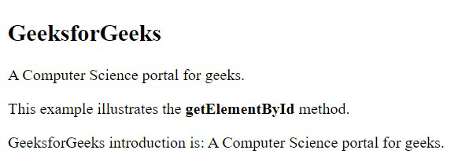

# Methods of the Document Object

## JavaScript Document Object Methods

JavaScript Document object also provides various methods to access HTML elements.

Now we will show you some of the commonly used methods of the document object:

## Window Object

- Window Object is object of the browser which is always at top of the hierarchy.  It is like an API that is used to set and access all the properties and methods of the browser. It is automatically created by the browser.
- Document object: When an HTML document is loaded into a window, it becomes a document object. The ‘document’ object has various properties that refer to other objects which allow access to and modification of the content of the web page. If there is a need to access any element in an HTML page, we always start with accessing the ‘document’ object. Document object is property of window object.
- Form Object: It is represented by form tags.
- Link Object: It is represented by link tags.
- Anchor Object: It is represented by a href tags.
- Form Control Elements:: Form can have many control elements such as text fields, buttons, radio buttons, checkboxes, etc.
Methods of Document Object:

- write(“string”): Writes the given string on the document.
- getElementById(): returns the element having the given id value.
- getElementsByName(): returns all the elements having the given name value.
- getElementsByTagName(): returns all the elements having the given tag name.
- getElementsByClassName(): returns all the elements having the given class name.

Example: In this example, We use HTML element id to find the DOM HTML element.

```HTML

<!DOCTYPE html>
<html>

<body>
 <h2>GeeksforGeeks</h2>

 <!-- Finding the HTML Elements by their Id in DOM -->
 <p id="intro">A Computer Science portal for geeks.</p>
 <p>This example illustrates the <b>getElementById</b> method.</p>
 <p id="demo"></p>
 <script>
  const element = document.getElementById("intro");
  document.getElementById("demo").innerHTML =
  "GeeksforGeeks introduction is: " + element.innerHTML;
 </script>
</body>

</html>

```

Output:

;

## What DOM is not? 

- The Document Object Model is not a binary description where it does not define any binary source code in its interfaces.
- The Document Object Model is not used to describe objects in XML or HTML whereas the DOM describes XML and HTML documents as objects.
- The Document Object Model is not represented by a set of data structures; it is an interface that specifies object representation.
- The Document Object Model does not show the criticality of objects in documents i.e it doesn’t have information about which object in the document is appropriate to the context and which is not.

