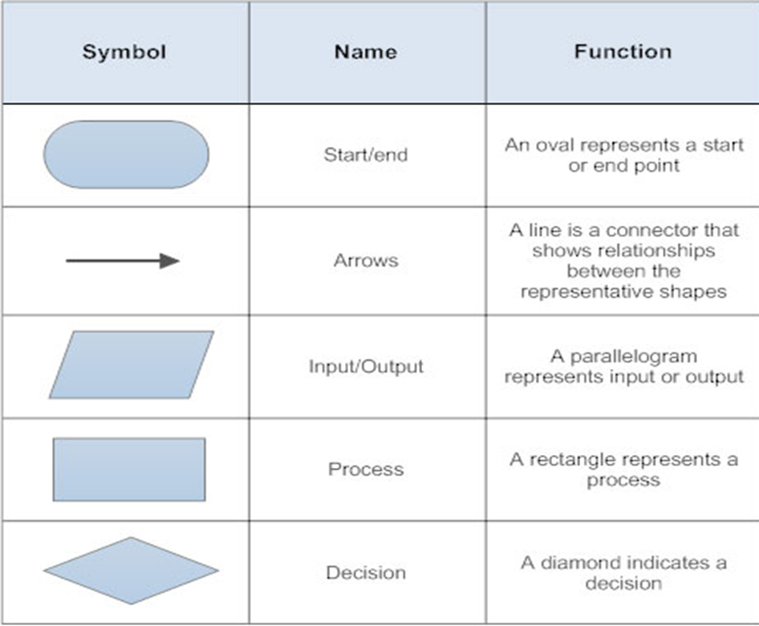
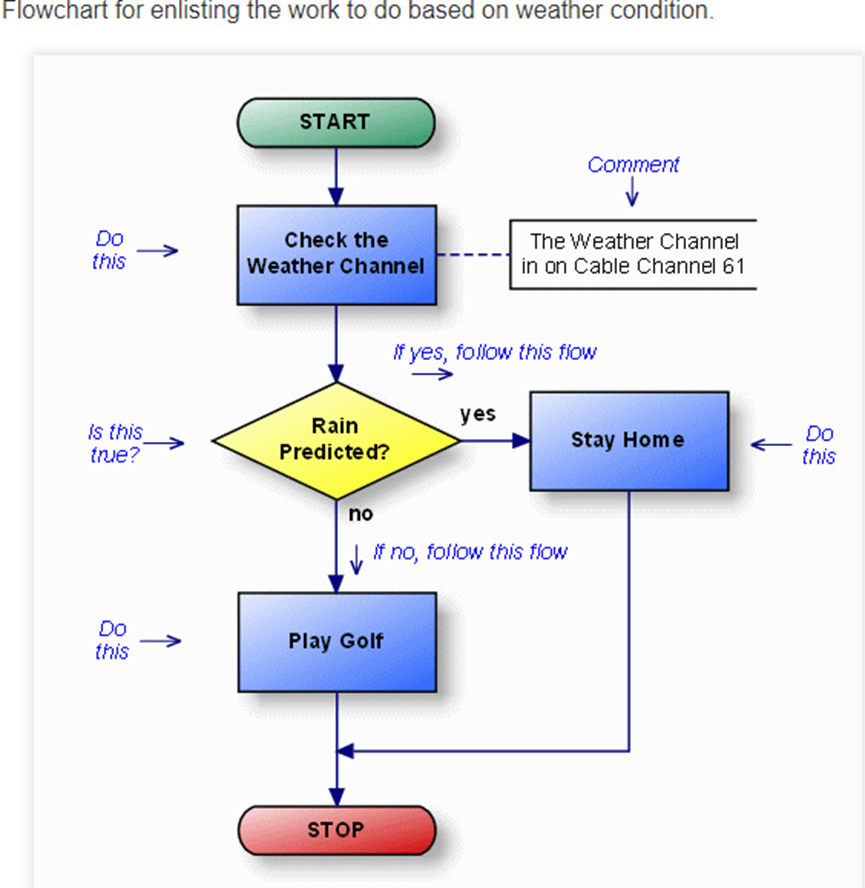

# Control Flow and Game Development Day 1 Program Flowcharts, Loops and Decision structures

A flowchart is a type of diagram that represents a workflow or process. A flowchart can also be defined as a diagrammatic representation of an algorithm, a step-by-step approach to solving a task.
The flowchart shows the steps as boxes of various kinds, and their order by connecting the boxes with arrows.

Common Flowchart symbols:

 

How it works?



 
## Rules for Creating Flowchart

- Flowchart should contain conventional symbols.
- Arrows should indicate flow from top to bottom or left to right.
- When designing, the fewer the connection symbols, the better.
- It should be easy to understand.
- It should not be written in a specific programming language.
- If the marks are small or big, there is no damage, but the shape should be correct.
- Designer must write comments where need with marks.
- Multiple flow lines intersect but do not imply any logical relationship between them.
- Designer must use separate flowchart for parts of one flowchart that requires detail description.
- It should be drawn on one page as far as possible. If more than one page is required, the previous page should be marked as used for the pre-determined process.

## JAVASCRIPT FOR-LOOP

A for loop repeats until a specified condition evaluates to false.
JavaScript supports various kinds of loops:

1.for - loops through a block of code several times
2.for/in - loops through the properties of an object
3.for/of - loops through the values of an iterable object 
4.while - loops through a block of code while a specified condition is true
5.do/while - also loops through a block of code while a specified condition is true

## The For Loop

The for loop has the following syntax:
for (statement 1; statement 2; statement 3) {
  // code block to be executed
}

- Statement 1 is executed (one time) before the execution of the code block.
- Statement 2 defines the condition for executing the code block.
- Statement 3 is executed (every time) after the code block has been executed.
- Statement 1 sets a variable before the loop starts (var i = 0).
- Statement 2 defines the condition for the loop to run (i must be less than 5).
- Statement 3 increases a value (i++) each time the code block in the loop has been executed.
EG, the example of the for loop below in JavaScript:

```JS
<!DOCTYPE html>
<body>
<h2>JavaScript let</h2>
<p id="demo"></p>

<script>
var i = 5;
for (var i = 0; i < 10; i++) {
  // some statements
}
document.getElementById("demo").innerHTML = i;
</script>
</body>
</html>

```